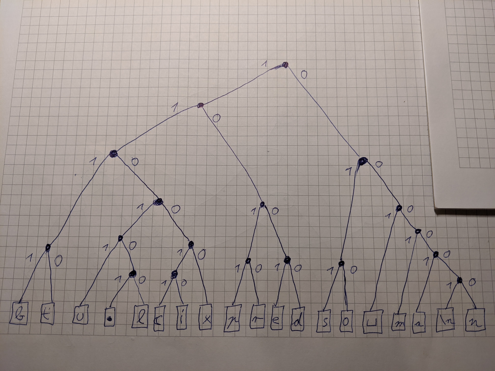

# Übung 1 - Teil 1: Textkodierung

## Aufgabe 1 - Fano-Bedingung

Die Fano-Bedingung bezeichnet die Eigenschaft einer Kodierung, präfixfrei zu sein. Präfixfreiheit bedeutet dabei, dass kein Codewort ein Präfix eines anderen Codewortes ist. Erfüllt wird diese Bedingung von der Huffman-Kodierung, während die statistische Kodierung sie im allgemeinen verletzt.

## Aufgabe 2 - Nachrichten-Kodierung

### 2a - UTF-8/UTF-16
Die Botschaft besteht aus 175 Zeichen. Da es sich dabei ausschließlich um ASCII-Zeichen handelt, benötigen diese im UTF-8-Code nur jeweils ein Byte, also 8 Bit. Insgesamt ergeben sich für UTF-8 ```8 * 175 = 1400``` Bits als Länge. Bei UTF-16 benötigt jedes ASCII-Zeichen eine 16-Bit-Einheit, was zu einer Gesamtlänge von ```16 * 175 = 2800``` Bits führt.

### 2b - Konstante Wortlänge

Die Botschaft enthält 19 unterschiedliche Zeichen. Die nächstgrößere Zweierpotenz ist 32, also werden pro Zeichen genau 5 Bit zur Kodierung benötigt (da ```2^5 = 32```). Da die Nachricht aus insgesamt 175 Zeichen besteht, werden für den gesamten Text also ```175 * 5 = 875``` Bits benötigt.

### 2c - Variable Wortlänge


Die Gesamtlänge der kodierten Nachricht errechnet sich als Summe von Häufigkeit mal Codelänge über die einzelnen Zeichen. Hier wäre die kürzestmögliche Kodierung der Nachricht also 396 Bits lang.

### 2d - Huffman-Kodierung

Es ergibt sich folgender Codebaum (welcher natürlich nur einer von mehreren möglichen ist). Wird die Nachricht mithilfe dieses Codebaums kodiert, so hat sie eine Länge von 689 Bits.



### 2e - Entropie

Mittels der in der Tabelle unter 2c angegebenen absoluten Häufigkeiten kann man die relativen Häufigkeiten der Zeichen bestimmen. Mittels dieser und der Gleichung zur Berechnung der Entropie ergibt sich:
```
-(2/175) * (-6.45121) + -(20/175) * (-3.12928) + -(3/175) * (-5.86625) + -(6/175) * (-4.86625) + -(15/175) * (-3.54432) + -(3/175) * (-5.86625) + -(10/175) * (-4.12928) + -(10/175) * (-4.12928) + -(3/175) * (-5.86625) + -(3/175) * (-5.86625) + -(10/175) * (-4.12928) + -(1/175) * (-7.45121) + -(20/175) * (-3.12928) + -(11/175) * (-3.99178) + -(10/175) * (-4.12928) + -(20/175) * (-3.12928) + -(15/175) * (-3.54432) + -(7/175) * (-4.64386) + -(6/175) * (-4.86625) 

= 3.91325
```
Somit beträgt die Entropie der Nachricht 3.91325. In Aufgabe 2b war der mittlere Speicherplatzbedarf pro Zeichen ```875/175 = 5``` Bits, während dieser in Aufgabe 2c ```396/175 = 2,263``` Bits betrug. Die Entropie liegt also zwischen diesen beiden Werten.

### 2f - &#x1F96E;

Bei diesem Zeichen handelt es sich um das Emoji "Mondkuchen" bzw. "Moon Cake" &#x1F96E;. In den einzelnen Unicode-Standards wird es folgendermaßen codiert:

UTF-8: 11110000 10011111 10100101 10101110

UTF-16: 11011000 00111110 11011101 01101110

UTF-32: 00000000 00000001 11111001 01101110

(zur besseren Lesbarkeit befindet sich nach jedem Byte ein Leerzeichen)