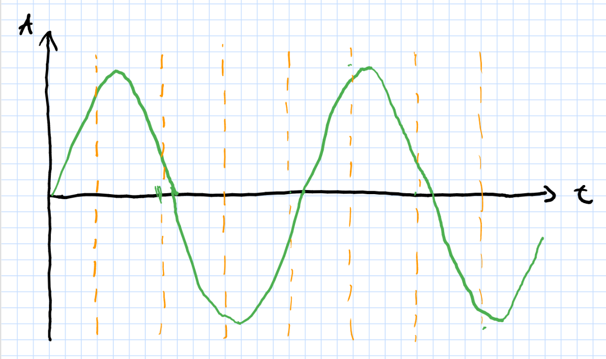
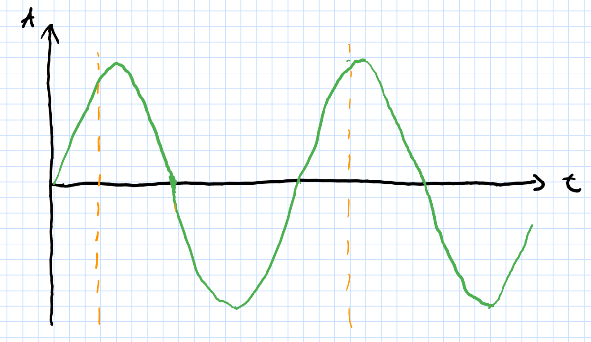
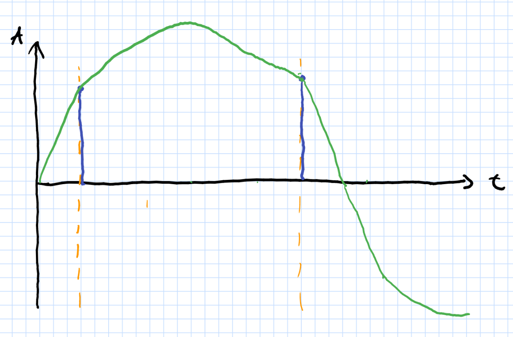

# WWW - Übung 3
(Matrikelnummer: 801005)
## Teil 1
### 2 - JSON-Ausgabe
Ja, die JSON-Ausgabe für die LZW-Komprimierung ist sinnvoll, da sie neben dem komprimierten String weitere wichtige Informationen enthält (die Länge eines Zeichens in Bits und das Anfangs-Wörterbuch), welche für die Dekodierung benötigt werden.

## Teil 2 - Grafik- und Audiokodierung
### 1 - Additive und subtraktive Farbmischung
Additive und subtraktive Farbmischung verwenden unterschiedliche Ansätze zur Mischung von Farben aus Grundfarben. 

Bei additiver Farbmischung werden zur Grundfarbe *Schwarz* andere Farben hinzugemischt (also addiert). Dieses Vorgehen findet man z. B. beim *RGB-Farbmodell*, bei dem Farben aus unterschiedlichen Anteilen der drei selbstleuchtenden Grundfarben Rot, Grün und Blau gemischt werden.

Bei subtraktiver Farbmischung dagegen werden von der Grundfarbe *Weiß* andere Farben abgezogen (also subtrahiert). Dieser Ansatz ist beim *CMY(K)-Farbmodell* zu finden, bei dem Farbpigmente der Grundfarben Cyan, Magenta, Yellow/Gelb und gegebenenfalls Schwarz auf eine weiße Oberfläche aufgetragen werden.
### 2 - YUV
Beim YUV-Farbmodell werden Farben nicht mittels anderer Farben gemischt, sondern in einen Helligkeitsanteil (Luminanz) und einen Farbanteil (Chrominanz) zerlegt. 

Alle drei Modelle haben ihre Daseinsberechtigung, da sie für unterschiedliche Zwecke verwendet werden. Das RGB-Modell wird zur Speicherung von Grafiken und zur Darstellung auf Bildschirmen benutzt, CMYK dagegen zum Druck, während YUV sich gut zur Farbübertragung bei Analogfernsehen bzw. als YCbCr für JPEG-Komprimierung benutzt wird eignet.
### 3 - HSV-Farbkodierung
Um umrechnen zu können, normieren wir zunächst die RGB-Kodierung auf [0,1] und erhalten ```(R, G, B) = (244/255, 10/17, 14/85)```. Nun können wir die in den Folien angegebenen Formeln anwenden und erhalten:
``` 
m1 = max(R, G, B) = 244/255
m2 = min(R, G, B) = 14/85
delta = m1 - m 2 = 202/255

S = delta/m1 = (202/255)/(244/255) 
  = 101/122 = 0,828 (rund)

V = m1 = 244/255 = 0,957 (rund)

H = 60° * ((G-B)/2)
  = 60° * 18/85
  = 12,706° (rund)
(da m1 = R)
```
### 4 - Chroma Subsampling
Chroma Subsampling wird verwendet, um die Datenmenge bei der Speicherung von Grafiken zu reduzieren, indem Farbinformationen (im Gegensatz zu Helligkeitsinformationen) mit reduzierter Auflösung gespeichert werden. Dies funktioniert, da das menschliche Auge Farbinformation nur mit reduzierter Auflösung im Vergleich zu Helligkeitsinformation wahrnimmt.

Die einzelnen Angaben bedeuten:
 - 4:4:4 - kein Subsampling, Farbpixel werden mit der gleichen Auflösung wie Helligkeitspixel gespeichert
 - 4:2:2 - Farbpixel werden mit halbierter Auflösung in horizontaler Richtung (im Vergleich zur Helligkeit) gespeichert. Es werden also jeweils 2 Pixel zusammengefasst.
 - 4:2:0 - Farbpixel werden mit halbierter Auflösung in beiden Richtungen gespeichert. Es werden also jeweils 4 Pixel zusammengefasst.
 - 4:1:1 - Farbpixel werden mit einem Viertel der Auflösung in horizontaler Richtung gespeichert. Es werden also jeweils 4 Pixel zusammengefasst.

### 5 - Abtasttheorem

a)


b)


c)


## Teil 3 - Multimediale Daten
### 1 - Datenmenge
#### a - LNCS
Durch Nachzählen in einem [Beispiel-LNCS-Paper](https://latextemplates.github.io/LNCS/paper.pdf) kam ich auf eine Zeilenanzahl pro Seite von ungefähr 35. UTF-8-Zeichen können bis zu 4 Bytes umfassen, aber wir gehen davon aus, dass nahezu alle ASCII-Zeichen sind (da es sich um eine Textseite handelt) und rechnen mit 1 Byte pro Zeichen.

Nun enthält eine Seite rund ```84 * 35 = 2940``` Zeichen, von denen jedes 1 Byte, also 8 Bit benötigt. Also benötigt die Seite eine Datenmenge von ```2940 * 8 = 23520``` Bit.
#### b - Monitor
Wir gehen davon aus, dass der Monitor (wie allgemein üblich) das Bild mittels des RGB-Farbmodells darstellt und für jede Farbkomponente 8 Bit verwendet. Dann ergibt sich eine Datenmenge von ```3840 Pixel * 2160 Pixel * 60 1/s * 3 Farbkomponenten/Pixel * 8 Bit/Komponente =  11 943 936 000 Bit/s```.
#### c - Poster
Ein Din-A1-Poster ist 594 mm x 841 mm groß. Da ```1 Zoll = 25,4 mm```, ergibt sich eine Pixeldichte in Pixel pro mm von ```300 dpi / 25,4 = 11,8 Pixel/mm (rund)```. Folglich hat das Poster eine Auflösung von  ```7009 * 9924``` Pixel, da ```594 mm * 11,8 Pixel/mm = 7009 (rund)``` und ```841 mm * 11,8 Pixel/mm = 9924 (rund)```. Das ergibt insgesamt ```7009 * 9924 = 69 557 316``` Pixel. Jedes dieser benötigt ```12 Bit/Farbkomponente * 4 Komponenten = 48 Bit```. Insgesamt werden also ```69 557 316 Pixel * 48 Bit/Pixel = 3 338 751 168 Bit``` als Datenmenge benötigt.
#### d - Telefonat
14 Minuten sind genau ```14 * 60 = 840``` Sekunden. Mit den in der Aufgabe gegebenen Daten und dem Wissen, dass Telefone Audiodaten nur mit einem Kanal übertragen, ergibt sich:
```840 s * 8000 1/s * 8 Bit * 1 = 53 760 000 Bit``` als Datenmenge.
### 2 - Schul-Cloud
a)
 1. Video
 2. Text
 3. Grafiken

b) Insbesondere bei Videos und Grafiken sollte darauf geachtet werden, dass entsprechende Komprimierungsverfahren verwendet werden, sodass keine großen Datenmengen übertragen werden müssen, aber die Qualität für die menschliche Wahrnehmung möglichst unverändert bleibt.


## Teil 4 - Videokodierung
### 1 - Interlacing

In obigem [Beispiel]((https://www.youtube.com/watch?v=uFtHTHkV0kY)) ist Interlacing sehr gut sichtbar. So verschwimmen die eigentlich geraden Linien auf der Fassade des Gebäudes im Hintergrund durch das Zeilenflimmern. Gut erkennbar wird Interlacing beispielsweise, wenn eine Kante genau zwischen zwei Bildzeilen fällt, also nur in einem Teilbild sichtbar ist, und es dadurch zu Zeilenflimmern kommt. Dies ist noch ausgeprägter, wenn das aufgenommene Bild detailreich und scharf ist.
### 2 - AV1
#### a - Verbesserungen
AV1 unterteilt das Bild in Superblocks, die prediktiv kodiert oder rekursiv in kleinere Blöcke unterteilt werden. Außerdem verwendet AV1 einen nicht-binären Entropiekodierer anstelle eines binären bei VP9.
#### b - Effizienz
Laut [https://de.wikipedia.org/wiki/AOMedia_Video_1](https://de.wikipedia.org/wiki/AOMedia_Video_1) und [https://www.texpion.com/2018/07/av1-vs-vp9-vs-avc-h264-vs-hevc-h265-2-psnr.html](https://www.texpion.com/2018/07/av1-vs-vp9-vs-avc-h264-vs-hevc-h265-2-psnr.html) liegt die Speicherplatzausnutzung ungefähr auf dem Niveau von H.265 und ist teilweise sogar besser. Die Effizienzsteigerung beträgt somit zwischen 20 % (= die Effizienzsteigerung bei H.265) und (nach obiger Quelle) bis zu 50 %.