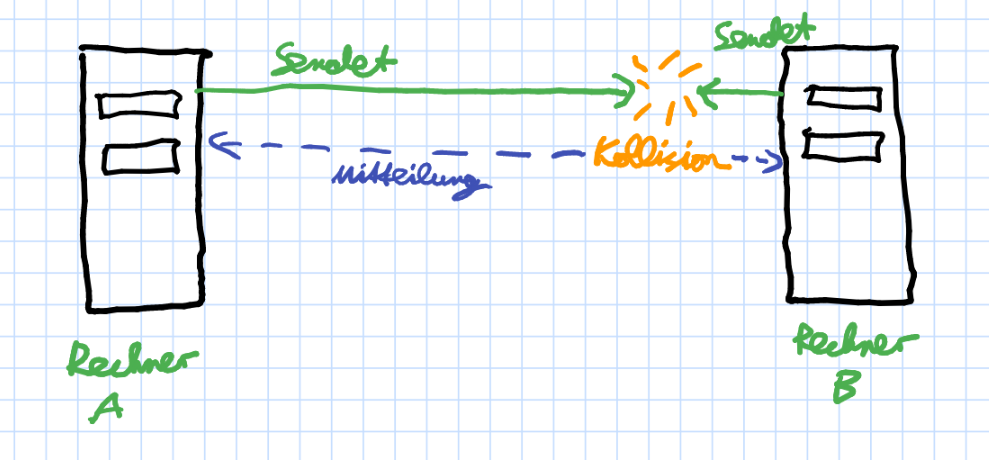
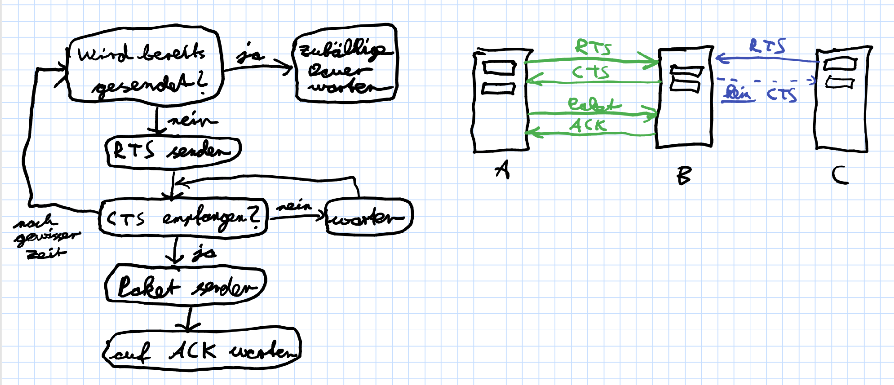

# WWW - Übung 5

## Teil 1 - Hamming-Code

Wir sehen uns jeweils die für die Paritätsbits benötigten Bitstrings an (also z.B. für das erste Paritätsbit Stelle 1, 3, usw.) Dabei ergeben sich die folgenden Bitstrings:
```
P1: 11111000
P2: 11111000
P4: 01110000
P8: 11100000
```
Wenn kein Übertragungsfehler aufgetreten ist, müsste die Parität (Anzahl der 1-Bits) jeweils gerade sein. Das ist hier aber nie der Fall, denn alle Paritäten sind ungerade. Folglich ist an Stelle 1 + 2 + 4 + 8 = 15 ein Übertragungsfehler aufgetreten. Somit lauten die korrekten Nutzdaten, wenn man die Paritätsbits entfernt und das fehlerhafte Bit flippt:
``` 11111100001 ```

## Teil 2 - LAN-Technologien

### 1 - Collision Domain und Broadcast Domain

Collision Domains entsprechen einem Ethernet-Segment, also einer Rechnergruppe an einem Bus. Sie sind dadurch gekennzeichnet, dass die Netzwerkgeräte um den Zugriff auf ein gemeinsames Übertragungsmedium konkurrieren, welches zwischen allen Geräten geteilt wird. Eine Broadcast Domain dagegen ist ein Verbund von Netzwerkgeräten, in dem ein Broadcast alle Mitglieder erreicht, und besteht aus einer oder mehreren Collision Domains. Ein Beispiel einer Collision Domain ohne Hub ist aus Koaxialkabeln aufgebautes Ethernet (10BASE2 oder 10BASE5).

### 2 - LAN-Größe

Die Anzahl der Rechner wird dadurch beschränkt, dass die Netzwerkinfrastruktur (Switches etc.) nur auf eine gewisse Rechneranzahl ausgelegt ist. Außerdem würde eine große Rechneranzahl meist auch eine große räumliche Ausdehnung bedingen. Die räumliche Ausdehnung wird vor allem dadurch beschränkt, dass die verwendete Verbindungsinfrastruktur meist nicht auf besonders große Reichweiten ausgelegt ist. Außerdem würde es sich ab einer gewissen Ausdehnung per Definition um ein MAN oder WAN handeln.

### 3 - Ethernet Frames

Die Mindestpaketgröße dient dazu, die Kollisionserkennung mittels CSMA/CD zu gewährleisten. Insbesondere soll damit sichergestellt werden, dass eine Kollision den Sender noch erreicht, bevor er die Übertragung eines Pakets abgeschlossen hat und es als fehlerfrei gesendet einstuft. So kann er dann eine Sendewiederholung durchführen. Die Mindestpaketgröße muss dabei so dimensioniert sein, dass sie mindestens so groß wie die maximale Round-Trip-Time (also die Zeit zwischen den beiden am weitesten entfernten Netzwerkgeräten - hin und zurück). Das gewährleistet, dass eine Kollision, selbst wenn sie sehr weit vom Sender entfernt stattfindet, von ihm noch erkannt werden kann, bevor das Senden beendet ist.


### 4 - MAC-Adressen

a) Bekanntlich führt jedes Netzwerkgerät eine ARP-Table, in der die Zuordnung zwischen MAC- und IP-Adressen im LAN gespeichert wird. Haben nun zwei Geräte die gleiche MAC-Adresse, werden in dieser Tabelle auch zwei IPs die gleiche MAC zugeordnet. Soll nun an eines dieser Geräte ein Paket gesendet werden, landet es bei beiden (und wird von einem der beiden anschließend verworfen) oder mal beim einen, mal beim anderen, je nachdem auf welchem Stand die ARP-Tabellen der Geräte sind und wie schnell die Geräte auf ARP-Requests antworten. 

Die Kommunikation zwischen den beiden Geräten mit gleicher Adresse wird gar nicht funktionieren, da Switches o.ä. Pakete mit identischer Quell- und Zieladresse verwerfen. Das alles beeinträchtigt die Performance im Netz und führt zu einer deutlich verlangsamten Kommunikation.

b) Normalerweise werden MAC-Adressen durch den Hersteller der Netzwerkkarte bei der Herstellung vergeben.

c) Man kann ableiten
* ob es sich um eine Broad/Multicast-Adresse oder eine individuelle Adresse handelt
* ob die MAC-Adresse global oder lokal eindeutig ist
* von wem die Netzwerkkarte hergestellt wurde
* (und natürlich identifiziert die MAC-Adresse Geräte eindeutig.)

### 5 - MACA
a) MACA vermeidet Kollisionen beim gleichzeitigen Zugriff mehrerer Geräte auf das Übertragungsmedium im WLAN.

b) Carrier Sense Multiple Access/Collision Avoidance
Request-To-Send/Clear-To-Send (CSMA/CD RTS/CTS)

c) Das MACA-Protokoll beginnt damit, dass der Sender ein Paket senden möchte. Bevor er dies jedoch darf, misst er zunächst, ob auf dem Medium momentan bereits gesendet wird. Wenn ja, muss er erst eine zufällige Dauer warten und dann erneut messen. Wenn nein, sendet er ein Request-To-Send (RTS) an den Empfänger und wartet auf dessen Bestätigung mittels eines Clear-To-Send (CTS). Trifft diese nach einer gewissen Zeit nicht ein, ist wahrscheinlich eine Kollision aufgetreten und der Sender muss erneut beginnen. Sonst darf er das Paket senden und wartet wiederum auf dessen Bestätigung durch den Empfänger mittels ACK.

Wenn nun nach dem CTS ein zweiter Sender senden möchte, empfängt dieser zum einen das CTS und das ACK des Empfängers und weiß, dass er zwischen diesen nicht senden darf. Zum anderen bekommt er vom Empfänger auch kein CTS, darf also auch deshalb nicht zu senden beginnen.


(Tut mir leid, da fehlt ganz oben ein Pfeil ;)

### 6 - Verfügbarkeit

a) Ein solcher Angriff wäre ein (Distributed) Denial of Service-Angriff (DoS bzw. DDoS), bei dem einzelne Netzwerkgeräte mit einer übermäßig hohen Paketanzahl geflutet werden, sodass sie nicht mehr auf alle Anfragen reagieren können.

b) 
* Ausfall der Stromversorgung oder schwankende Stromversorgung
* Ausfall notwendiger Hardware und Netzwerkinfrastruktur
* Überlastung der Netzwerkinfrastruktur

c)

* Unterbrechungsfreie Stromversorgungen, die Stromausfälle mittels Akkus abfangen
* redundant ausgelegte Hardware (z.B. Festplatten in RAID, Verbindung von Servern zu Switches mit mehreren Netzwerkkabeln etc.)
* Auslegung der Netzwerkinfrastruktur, sodass sie mit höherer Last zurechtkommt (z.B. mehr Server, schnellere Verbindungen)

d) Aufsteigend nach Preis sortiert ist die Reihenfolge Offline USV, Line-Interactive USV, Online USV. Unterscheidungskriterien sind z.B. Abhängigkeit von Spannung und/oder Frequenz vom Stromnetz, Einsatzgebiet, Wirkungsgrad, Umschaltzeiten und Störungstypen, gegen die die betreffende USV schützt (Netzausfall, Spannnungsschwankung etc.).

### 7 - Paketsniffer

b) ```ip.src==141.89.225.126 or ip.dst==141.89.225.126``` (Die angegebene IP ist die des hpi.de-Servers; da die Verbindung mit TLS verschlüsselt ist, ist es nicht möglich, dies mittels der URL durchzuführen)

c) tcpdump
## Teil 3 - Server

### 1 - Flag

```aafcc054dc90c44d8e50f40254d3504c48381bbbb4b1f6c5fca12bc3e0318af3```

### 2 - Bonus-Flag

```39e1a3cccb02892b97b3816faf5610e15ac4ec1b5b3c1bfd57c53bd6789ccd7f```