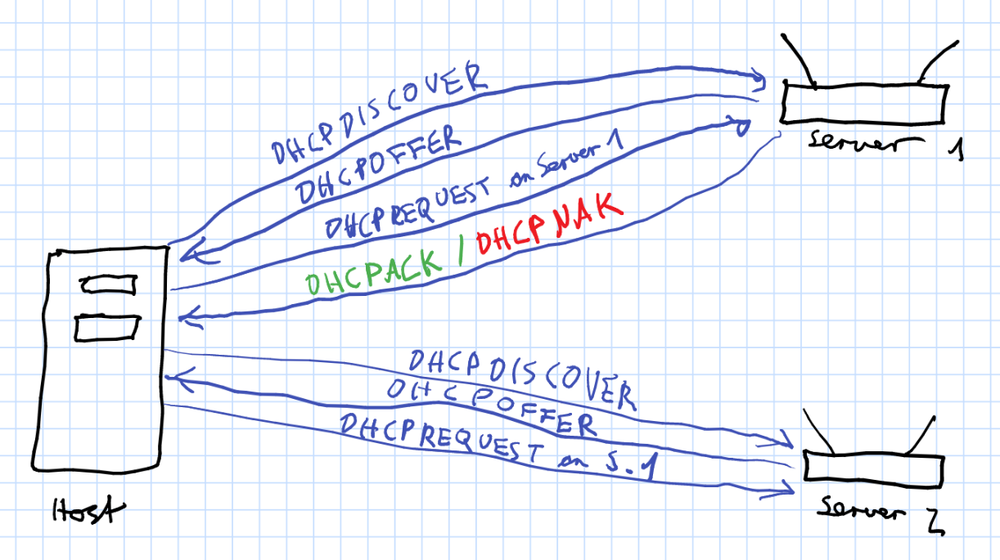

# WWW - Übungsblatt 6

(Matrikelnummer: 801005)

## Teil I - Routing-Tabellen

### 1 - Dijkstra-Algorithmus


### 2 - Distanzvektor-Routing

Wir addieren zunächst zu den Distanzvektoren von B, D und E jeweils die Verzögerung von C zum jeweiligen Knoten und erhalten

```python
B: (9, 6, 14, 18, 11, 8)
D: (10, 15, 9, 3, 11, 13)
E: (12, 11, 8, 14, 5, 7)
```

Für C ist die Distanz nun offensichtlich 0 und für alle anderen Knoten nehmen wir jeweils das Minimum der Distanz in den obigen Vektoren (und den entsprechenden Next Hop):

Knoten | Next Hop | Distanz
------ | -------- | ------
A | B | 9
B | B | 6
C | - | 0
D | D | 3
E | E | 5
F | E | 7

## Teil II - Recherche-Aufgaben

### 1 - DHCP

Benötigt ein Client eine neue IP-Adresse, so schickt er eine DHCPDISCOVER-Nachricht mit seiner MAC-Adresse als Broadcast an alle DHCP-Server in der Broadcast Domain. Nun antworten die DHCP-Server mit Vorschlägen für eine IP-Adresse per DHCPOFFER. Nun kann der Client unter den eingegangenen Angeboten wählen und anschließend den entsprechenden Server wieder per Broadcast mit einem DHCPREQUEST kontaktieren. Für alle anderen Server ist dies als Absage für ihre Angebote zu werten. Nun bestätigt der Server entweder per DHCPACK die gewählte IP-Adresse oder zieht sein Angebot per DHCPNAK zurück.  Üblicherweise prüft der Client nun per ARP-Request, ob diese IP-Adresse nicht doch verwendet wird. In diesem Fall würde er die IP-Adresse per DHCPDECLINE zurückweisen.



Quelle: <https://de.wikipedia.org/wiki/Dynamic_Host_Configuration_Protocol>

### 2 - Informationsaustausch bei DHCPv4

Die einzelnen Nachrichten bei der DHCP-Adresszuweisung enthalten folgende Informationen:

1. DHCPDISCOVER
   * Absender: 0.0.0.0 (da noch keine eigene IP-Adresse vorhanden)
   * Zieladresse: 255.255.255.255 (Broadcast)
   * MAC-Adresse des Clients
   * optional Vorschläge für bevorzugte IP-Adressen oder Leasedauer
2. DHCPOFFER
   * Broadcast an 255.255.255.255 *oder* Unicast an vorgeschlagene IP-Adresse und MAC-Adresse des Clients
   * Vorschläge für IP-Adresse des Clients ('yiaddr'-Feld)
   * Server-Identifier
   * weitere Konfigurationsparameter
3. DHCPREQUEST
   * Broadcast
   * Server-Identifier des angenommenen Angebots
   * angenommene IP-Adresse
   * optional vom Client gewünschte Konfigurationsparameter
   * optional Client-Identifier für die weitere Kommunikation (sonst wird MAC-Adresse genutzt)
4. DHCPACK
   * Bestätigung der IP-Adresse
   * enthält erneut die IP-Adresse sowie weitere Konfigurationsparameter
   * Client-Identifier
   * Leasedauer
5. DHCPNAK
   * Ablehnung der IP-Adresse durch den Server
6. DHCPDECLINE
   * Ablehnung der IP-Adresse durch den Client

Quelle: siehe Aufgabe 1 sowie <https://tools.ietf.org/html/rfc2131>

### 3 - DHCPv6 und Router Advertisement

Router Advertisement ist das für IPv6 bevorzugte Pendant zu DHCP. Hierbei weist sich ein Host zunächst selbst eine link-lokale IP zu, um mit dem Router kommunizieren zu können. Anschließend kann er über NDP die Router in seinem Netzwerksegment finden, auch bekannt als Router Solicitation (per Anfrage an eine spezielle Multicast-Adresse). Nun versendet der Router per Router Advertisement Informationen zu den verfügbaren Adressbereichen für Unicast-Adressen und der Host weist sich selbst eine IP zu. Dabei werden Doppelvergaben über Duplicate Address Detection verhindert.

DHCPv6 funktioniert im wesentlichen wie DHCP für IPv4. Jedoch können zusätzlich Informationen z.B. über NTP- und SIP-Dienste mitgeteilt werden und DHCPv6 auf bestimmte Clients eingeschränkt werden. Außerdem ist es möglich, Router Advertisement für die eigentliche Adressvergabe zu integrieren.

Der wesentliche Unterschied zwischen beiden Protokollen ist, dass bei DHCPv6 die Adressvergabe "stateful" durch den Router erfolgt, bei Router Advertisement aber "stateless" durch den Host selbst. Außerdem können über Router Advertisement keine der oben erwähnten Zusatzinformationen mitgeteilt werden.

Quelle: <https://de.wikipedia.org/wiki/IPv6#Autokonfiguration> und <https://de.wikipedia.org/wiki/Dynamic_Host_Configuration_Protocol>

### 4 - Neighbor Discovery

#### a - Neighbor Discovery Protocol

NDP übernimmt die Funktion des Address Resolution Protocol (ARP) bei IPv6. Es ist also für die Auflösung von IPv6-Adressen zu MAC-Adressen verantwortlich.

Quelle: <https://de.wikipedia.org/wiki/Neighbor_Discovery_Protocol>

#### b - Unterschiede IPv4 und NDP

* NDP führt die Adressauflösung mittels ICMP auf dem Internet Layer statt wie ARP auf dem Link Layer durch. Dadurch ist es weniger vom Medium abhängig.
* IPv6-Router können über NDP eine für den gesamten Link (also alle Hosts) geltende MTU bekanntgeben. Bei ARP ist das nicht möglich.
* Mittels Router-Advertisement-Nachrichten kann NDP eine automatische Adresskonfiguration durchführen (ähnlich wie DHCP bei IPv4).

Quelle: <https://docs.oracle.com/cd/E19957-01/820-2980/chapter1-41/index.html>

### 5 - Netzmaske und IP-Adressen

Die Netzmaske ist hier 255.255.192.0. Das Netz 249.151.128.0/18 umfasst alle IP-Adressen, bei denen die ersten 18 Bits genau den ersten 18 Bits von 249.151.128.0 entsprechen. Die ersten 16 Bit (also 249.151) stimmen bei 249.151.101.89 und 249.151.201.83 offensichtlich jeweils überein. Nun schreiben wir das dritte Byte der IPs jeweils in binär:

```python
128 = 10000000
101 = 01100101
201 = 11001001
```

Wie man sieht, unterscheiden sich bei beiden IPs jeweils die ersten zwei Bit des dritten Bytes vom Netz. Folglich ist keine der beiden IP-Adressen in diesem Netz enthalten.

### 6 - IP-ID

Eine IP-ID wird zum Zusammensetzen von zuvor fragmentierten IP-Datenpaketen beim Empfänger benötigt. Mithilfe dieses Feldes und der Source Address kann er die Zusammengehörigkeit von Fragmenten feststellen und sie mithilfe des Headerfelds *Fragment Offset* wieder zusammensetzen.

RFC 791 definiert das Identification-Headerfeld als
> An identifying value assigned by the sender to aid in assembling the fragments of a datagram.

Damit wird explizit nicht vorgeschrieben, dass die ID fortlaufend sein muss. Sie muss lediglich pro Paket eindeutig sein, um die Zusammengehörigkeit der Fragmente feststellen können. Die Reihenfolge der Fragmente wiederum wird durch den Fragment Offset festgelegt und nicht durch die IP-ID.

Quelle: <https://tools.ietf.org/html/rfc791>

### 7 - traceroute

Traceroute arbeitet mithilfe von ICMP-Echo-Requests, welche an den Zielhost gesendet werden. Solche Echo-Requests entsprechen dabei der Aufforderung, das erhaltene Paket unverändert zurückzusenden. Dabei kann eine Time To Live (TTL), also die maximale Anzahl an Hops, mitgesendet werden. Traceroute sendet zunächst ein Paket mit einer TTL von 1 an den Zielhost. Der erste Router dekrementiert nun die TTL und sendet, da die TTL nun 0 ist, eine ICMP-Antwort "Time Exceeded" an den Sender, wobei er als Source seine eigene IP-Adresse angibt. Nun wird das ganze mit immer um eins höheren TTLs wiederholt, wodurch auch die IP-Adressen aller weiteren Hops bekannt werden. Dies geht so lange, bis der Ziel-Host erreicht wird (der dann mit einer ICMP Echo Reply antwortet) oder die von Traceroute bestimmte Maximalanzahl an Hops erreicht ist.

Der von Traceroute ermittelte Weg muss nicht immer der tatsächliche sein. Dies kann zum Beispiel durch Firewalls, NAT, IP-Tunnel oder die Wahl einer anderen Route bei Überlastung beeinflusst werden.

(Eigentlich verwendet nur Windows-Traceroute ICMP. Linux-Traceroute benutzt UDP, erhält aber als Antwort auch ICMP-Pakete.)

Quelle: <https://de.wikipedia.org/wiki/Traceroute>

### 8 - Fragmentierung und MTU Path Discovery

Bei IPv4 erfolgt die Fragmentierung durch die Router auf dem Pfad zum Zielrechner. Stellt ein Router fest, dass das Paket für das nächste Teilnetz auf dem Pfad zu groß ist (dessen MTU überschreitet), kann er es in zwei (oder mehr) Fragmente aufteilen. Dabei werden die Nutzdaten an einer 64-Bit-Grenze aufgeteilt und die Headerdaten in die neuen Pakete kopiert. Außerdem wird beim ersten Fragment das "More Fragments"-Flag im Header gesetzt und die Fragment-Offset- sowie Längen-Felder entsprechend angepasst. Der Empfänger kann dann alle Fragmente mit der gleichen IP-ID wieder zusammensetzen, wobei über den Fragment Offset die Reihenfolge bestimmt wird.

Bei IPv6 erfolgt die Fragmentierung nun nicht mehr durch die Router, sondern durch den Sender. Sollte ein Router feststellen, dass ein Paket die MTU überschreitet, fordert er den Sender per ICMP auf, kleinere Pakete zu schicken. Damit der Sender nun Pakete mit maximal möglicher Größe verschicken kann, sollte er vor dem Senden eine MTU Path Discovery durchführen. Dabei wird zunächst ein Paket, dessen Größe der lokalen MTU entspricht, gesendet. Wird dieses von einem Router zurückgewiesen, muss die Größe entsprechend auf dessen MTU reduziert werden. Dies erfolgt so lange, bis das Paket den Sender erreicht, denn dann hat man die richtige MTU gefunden.

Quelle: <https://de.wikipedia.org/wiki/IPv4#Datagrammfragmentierung> und <https://de.wikipedia.org/wiki/Path_MTU_Discovery> und <https://de.wikipedia.org/wiki/IPv6#Paketgr%C3%B6%C3%9Fen>

### 9 - Verkürzung IP-Adresse

Gekürzt erhalten wir 0:0:500::400a:9999.

## Teil III - Routing in der Praxis

### 3 - Flag 10.60.110.2 und fd60:110::2

26d3d96d6c18a789e34b7875d5b09b7774154a1b5c36fe6390b2a6ae5cbf3b14

### 6 - Bonus-Flags


