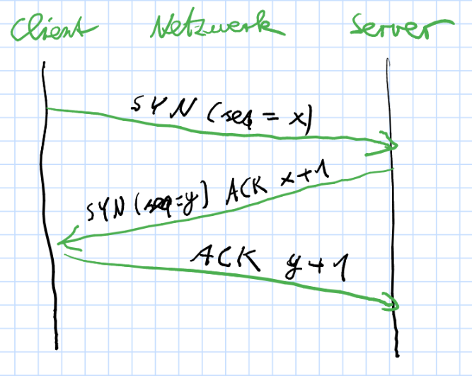
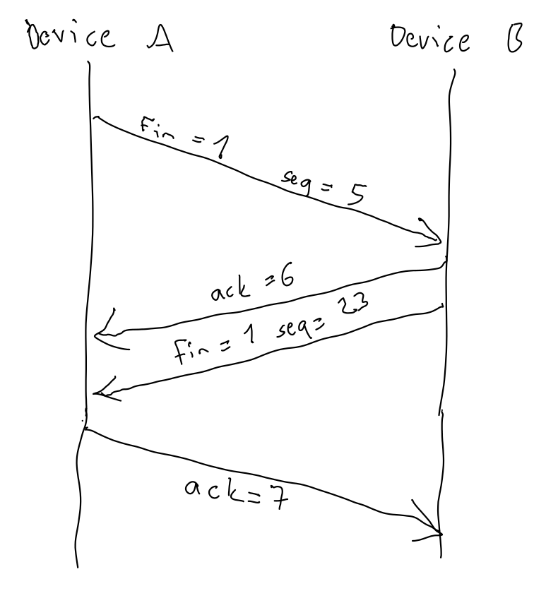

# WWW - Übungsblatt 7

## Teil I - TCP

### 1 - Handshake beim Verbindungsaufbau

Der Handshake für den Verbindungsaufbau setzt voraus, dass der Server einen Socket
(Portnummer und IP-Adresse) erzeugt hat und dort auf Verbindungen horcht. Wenn nun
ein Client eine Verbindung aufbauen will, erzeugt er selbst einen Socket und sendet
von diesem ein SYN-Paket mit einer (möglichst zufälligen) Sequenznummer x an den
Server. Dieser bestätigt nun den Erhalt und sendet ein kombiniertes SYN/ACK-Paket,
welches als Acknowledgement Number x+1 und als Sequenznummer ein beliebiges y ent-
hält. Zuletzt bestätigt nun noch der Client den Erhalt des SYN/ACK-Pakets, indem
er selbst ein ACK-Paket mit der Sequenznummer x+1 und der Acknowledgement Number
y+1 an den Server sendet. Anschließend ist die Verbindung aufgebaut und Client
und Server können gleichberechtigt darüber kommunizieren.

Beispielwerte für die Pakete wären:

* SYN 42
* SYN 1337 / ACK 43
* ACK 1338

Quelle: <https://de.wikipedia.org/wiki/Transmission_Control_Protocol#Verbindungsaufbau_und_-abbau>

### 2 - Handshake beim Verbindungsabbau

Will ein Kommunikationspartner nach dem Senden des letzten Datenpakets eine
Verbindung beenden, so sendet er ein TCP-Paket, in dem das FIN-Flag gesetzt ist.
Der Empfänger sendet ein Paket, dessen ACK-Wert um 1 höher ist als die Sequenz-
nummer des empfangenen Pakets. Außerdem sendet dieser ebenfalls ein Paket mit
FIN-Flag und zufällig gewählter Sequenznummer. Der Initiator des Verbindungs-
abbaus muss dieses Paket ebenfalls mit der inkrementierten Sequenznummer bestä-
tigen.

Quelle: <http://telescript.denayer.wenk.be/~hcr/cn/idoceo/tcp_connection.html>

### 3 - Wahl der initialen TCP-Sequenznummer

Die zufällige Wahl der Sequenznummer erhöht die Sicherheit. Falls dies nich
geschieht, kann ein Angreifer folgendermaßen TCP-Verbindungen übernehmen:
Er sorgt dafür, dass die Pakete der Servers den Client nicht mehr erreichen
und täuscht gegenüber dem Client die IP-Adresse des Servers vor. Nun ist es
ihm möglich, den Drei-Wege-Handshake mit dem Client zu beenden, wenn er die
nächste initiale Sequenznummer erraten kann. Dies ist relativ einfach möglich,
indem er eine weitere Verbindung zum Client aufbaut und damit Informationen
über dessen Wahl der Sequenznummer sammeln kann.

Quelle: <https://tools.ietf.org/html/rfc1948>

### 4 - Verlorengegangene TCP-Segmente im Internet

Da bei TCP alle Pakete eine Sequenznummer erhalten, kann genau
festgestellt werden, welches Paket verloren gegangen ist. Der
Empfänger fordert den Sender auf, dieses erneut zu senden
(TCP Retransmission).

Quelle: <https://en.wikipedia.org/wiki/Transmission_Control_Protoco>

### 5 - Identifikation einer TCP-Verbindung

* Quellsocket (IP-Adresse und Port von Alice)
* Zielsocket (IP-Adresse und Port von Bob)

## Teil II - UDP vs. TCP

### 1 - Messung TCP vs. UDP

Bei dem Vergleich der Wireshark- und time-Messungen fällt auf, dass der TCP-
Verbindungsabbau bei der time-Messung nicht mit eingeschlossen ist, ansonsten
sind die Messwerte relativ ähnlich (Abweichung um einstellige Millisekunden).
Es fällt auf, dass die Unregelmäßigkeiten der gemessenen Zeiten auf DNS zurückzu-
führen sind. DNS verbraucht immer mindestens 0.03s (also die Hälfte der Zeit
bei UDP), kann aber auch deutlich länger dauern. Interessant ist auch, dass bei
UDP genau 2 Pakete versendet werden, nur nämlich der Request mit der Nachricht "HELO"
sowie die zugehörige Antwort, bei TCP hingegen gibt es je 3 Pakete zum Verbindungsauf-
und abbau, sowie pro eigentlicher Nachricht noch je ein Acknowledgement, und damit
insgesamt 3+3+2+2=10 Pakete (5x mehr als UDP).

Insgesamt können wir aus unserem Experiment schließen, dass UDP (zumindest in
diesem speziellen Anwendungsfall) nahezu immer schneller als TCP ist,
durchschnittlich um 0.02 s.

### 2 - Vorteile von UDP

Da UDP ein einfacheres Protokoll mit weniger Overhead ist, eignet es sich
für zeitkritische Anwendungen, bei denen die exakte Übertragung von Daten weniger
wichtig ist. Beispielsweise ist bei Audio- und Videostreams ein einzelnes Paket von
geringer Bedeutung, wichtiger ist die Übertragung in Echtzeit. Eine erneute Übetragung
wie bei TCP-Retransmission würde trotz korrekterer Daten durch die höhere Latenz
die Nutzererfahrung verschlechtern.

### 3 - Vorteile von TCP

Die Nutzung von TCP ist dann sinnvoll, wenn Daten fehlerfrei übertragen werden müssen,
wie etwa bei der Übertragung von Dokumenten oder Bankdaten im Internet. Hier nimmt
aus Sicherheitsgründen einen höheren Protokoll-Overhead in Kauf.
