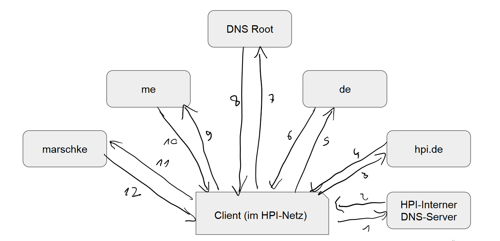
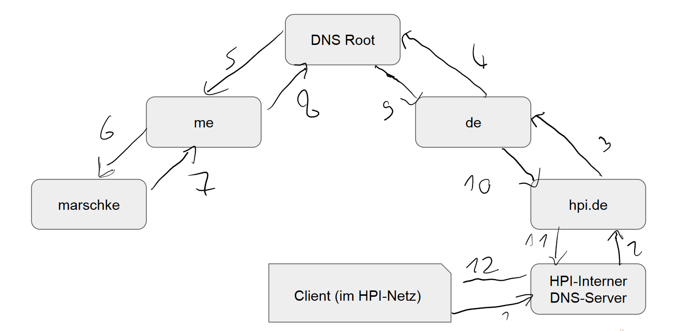

# WWW - Übungsblatt 8

(Matrikelnummern: 801005 und 801123)

## Teil 1 - DNS

### 1 - Iterative und rekursive Namensauflösung

Bei iterativer Namensauflösung meldet ein DNS-Server den hierarchisch nächsthöheren
DNS-Server zum Fortsetzen der Suche an den Client, sodass dieser dieser den nächsten
Aufruf tätigen kann. Bei rekursiver Namensauflösung führt der DNS-Server diesen Aufruf
selbst aus und gibt das Resultat dieses Aufrufs an den Client zurück.

Für Beispiele siehe  sowie 
Die Zahlen legen die Reihenfolge der Anfragen bzw Antworten fest.

### 2 - Reverse DNS

Bei rDNS lässt sich anhand einer für eine IP-Adresse herausfinden, welche Domäne
auf sie via DNS verweist. Dafür wird ein "PTR Resource Record" benötigt, der der
gewünschten IP-Adresse ihren Hostname zuordnet.

Eine Anwendungsmöglichkeit für rDNS ergibt sich bei Spamfiltern. Hier kann der Mailserver
die Domain des Versaandservers mit der Absenderadresse vergleichen. Passen diese
nicht zusammen oder existiert kein Eintrag, so wird die Mail als Spam markiert.

Quelle: <https://www.ionos.de/digitalguide/server/knowhow/reverse-dns/>

### 3 - Sicherheit

#### a - DNS Spoofing

Unter DNS-Spoofing versteht man Attacken, bei denen einem DNS-Server eine falsche
IP-Adresse für einen DNS-Request mit einer Domäne gesendet werden.
Dies ist problematisch, weil diese Information nicht nur einmalig an einen
Client weitergeleitet werden, sondern im DNS-Cache für eine begrenzte Zeit
zwischengespeichert werden. Alle Clients, die bis zur Invalidierung des Caches
versuchen die IP-Adresse der Domäne bei diesem DNS-Server aufzulösen erhalten somit
die gefälschte Adresse und werden somit zu einem potenziell bösartigen Server geleitet.

#### b - Verhinderung mit DNSSEC

Bei DNSSEC wird über digitale Signaturen sichergestellt, dass die Antwort auf
den DNS-Request tatsächlich von dem gewünschten DNS-Server stammt, und ncht von
einem Angreifer.

#### c - Zuverlässige Verhinderung

Mit DNSSEC kann Spoofing tatsächlich zuverlässig verhindert werden, jedoch sind weiterhin
Sicherheitsprobleme vorhanden. DNSSEC schützt etwa nur die Abfragen der Nameserver
untereinander, die Verbindung zwischen dem letzten DNS-Nameserver und dem Client
ist jedoch weiterhin angreifbar (falls man dies ebenfalls als DNS-Spoofing definiert,
kann Spoofing also doch nicht verhindert werden)

Quelle: <https://de.wikipedia.org/wiki/Domain_Name_System_Security_Extensions#Grenzen_von_DNSSEC>

#### d - DNS over HTTPS

DNS over HTTPS ist ein Protokoll, bei dem DNS-Anfragen mithilfe des sicheren HTTPS-Protokolls
übermittelt werden. Da bei HTTPS die Authentizität sichergestellt ist, wird
Spoofing verhindert. Außerem ist die Übertragung verschlüsselt, wodurch Angreifer
nicht mehr feststellen können, welcher Client welche DNS-Anfrage gesendet hat.

Quelle: Vorlesung Internetanwendungen 1

## Teil 2 - E-Mail

### 1 -  MIME

MIME ermöglicht es, andere Daten als nur ASCII-Text via Email zu versenden.
Am Anfang eines Dokuments wird dabei die Art des Dokuments sowie die Enkodierung
festgelegt, danach folgt der eigentliche Inhalt. Auch mehrere verschiedene
Datentypen sind möglich, dann muss am Anfang der Email der MIME-Content-Type auf
Multipart/Mixed gesetzt werden und vor jedem neuen Inhalt ein neuer Content-Type
definiert werden.

Quelle: Vorlesung Internetanwendungen 1

### 2 - Unterschiede POP3 und IMAP

POP3 und IMAP sind verschiedene Protokolle, um E-Mails zu empfangen. Der Haupt-
unterschied ist dabei, dass bei POP3 Dateien einmal übermittelt werden und der
Client danach für die Verwaltung der E-Mails verantwortlich ist. Bei IMAP speichert
der Server E-Mails auch, nachdem er sie erfolgreich an den Client gesendet hat.
Dies ist zwar ein Sicherheitsrisiko, da der Server weiterhin Zugriff auf die E-Mails
hat. Allerdings ist die Verwendung mehrerer E-Mail-Clients gleichzeitig nur mit IMAP
realistisch möglich, und bei Ausfall eines Clients gehen nicht alle Daten verloren.
Da heuzutage die meisten Menschen E-Mails sowohl auf ihrem Computer als auch auf
ihrem Smartphone empfangen wollen, ist IMAP daher unerlässlich.

### 3 - Email-Spoofing

Im SMTP-Protokoll zum Versenden von E-Mails ist keinerlei Authentifizierung vorgesehen.
Dadurch ist es für jeden möglich, E-Mails unter jeder beliebigen Adresse zu versenden.
Es gibt verschiedene Ansätze, die Authentizität von E-Mails sicherzustellen. Beispielsweise
löst die Signierung der E-Mails in PGP dieses Problem.

Quelle: Vorlesung Sicherheit im Internet 1, Übung 9

## Teil 3 - FTP

### 1 - FTP Sicherheit

Das fundamentalste Sicherheitsproblem bei FTP ist, dass sämtliche Daten
unverschlüsselt übertragen und gespeichert werden, was insbesondere bei
Login-Daten oft nicht gewünscht ist. Auch ist es bei FTP-Verbindungen aufgrund
der fehlenden Integritätsüberprüfung möglich, gesendete Daten mittels
Spoofing-Angriffen auf einen fremden Rechner umzuleiten, wodurch dieser Daten
auf den Client übertragen kann oder bereits auf diesem vorhandene Daten
einsehen und bearbeiten kann. Außerdem läuft der FTP-Server, da er den
priviliegierten Port 20 benutzt, als Root, was eine weitere Sicherheitslücke darstellt.

Quelle: <https://www.totemo.com/de/aktuelles/blog/blog-unsichere-ftp-server-immer-noch-eine-bedrohung>
und <https://www.wise-ftp.de/know-how/ftp_und_sftp_protokoll.htm>

### 2 - Alternativen zu FTP

* FTP over TLS (FTPS), wobei die Daten auf dem Kontrollkanal und optional auch
  auf den Nutzdatenkanälen mit TLS verschlüsselt werden. Dadurch wird die Schwachstelle
  der unverschlüsselten Übertragung behoben.
* SSH File Transfer Protocol (SFTP), wobei Daten und Kontrollinformationen
  verschlüsselt über SSH übertragen werden. Dies behebt die Schwachstelle
  der unverschlüsselten Übertragung behoben sowie zusätzlich auch die
  Integrität der Daten überprüft.
  
Quelle: <https://de.wikipedia.org/wiki/SSH_File_Transfer_Protocol>
und <https://de.wikipedia.org/wiki/FTP_%C3%BCber_SSL>

## Teil 4 - IP Spoofing

### 1 - Definition IP Spoofing

IP-Spoofing beschreibt das Versenden eines IP-Packets mit gefälschter Absender-Adresse.
Dies ist möglich, weil im IP-Protokoll keine Überprüfung der Absender-Adresse
vorgesehen ist.

Quelle: Vorlesung Internetanwendungen 1

### 2 - IP Spoofing Skript

Dies lässt sich gut mit dem Tool *hping3* bewerkstelligen, welches zuvor
natürlich aus den Paketquellen installiert werden muss:

```bash
hping3 -S 130.1.2.3 -a <spoofed IP> -c 1 -p 8080
```

Wahlweise lässt sich auch eine zufällige Absender-IP-Adresse einstellen:

```bash
hping3 -S 130.1.2.3 --rand-source -c 1 -p 8080
```

Quelle: <http://sites.psu.edu/cvclab/wp-content/uploads/sites/24816/2016/06/ip_spoofing.pdf>
und die Manpage von hping3

## Teil 5 - Certification Authorities

### 1 - Definition und Hauptaufgaben

Eine Certification Authority ist ein wesentlicher Bestandteil der Public-Key-Infrastruktur.
Sie gibt dabei digitale Zertifikate heraus, die einen bestimmten Public Key einer
Person bzw. Organisation zuordnen. Die CA beglaubigt diese Zuordnung, indem sie
sie mit ihrer elektronischen Signatur versieht. Weiterhin überprüft sie diese auf
Echtheit. Damit trägt sie die Verantwortung für die Bereitstellung, Zuweisung und
Integritätssicherung der von ihr ausgegebenen Zertifikate.

Quelle: <https://de.wikipedia.org/wiki/Zertifizierungsstelle>

### 2 - CAs im Browser

Mein Browser nimmt 75 CAs als vertrauenswürdig an, darunter auch den
"Verein zur Foerderung eines Deutschen Forschungsnetzes e. V."
(ich hab extra per Hand nachgezählt ;)
