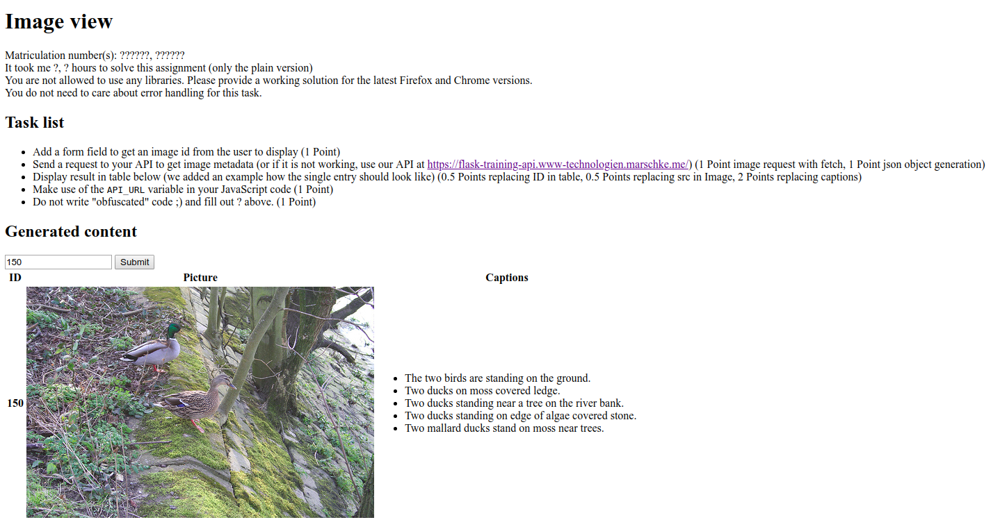
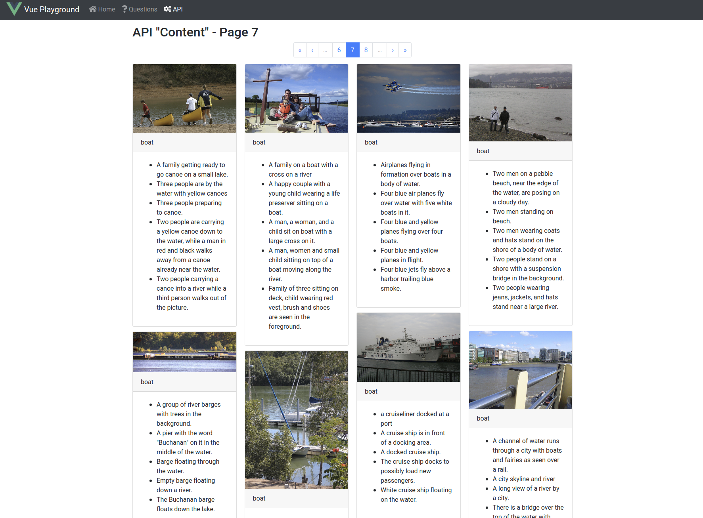

# HTML Training
Welcome to this assignment! We hope you had a lot of fun with building the API in your last assignment.
This week you will build two different user interfaces on top of your API (or one of ours if yours is not fully working).

One user interface will be in plain web languages like HTML5 and JavaScript (without any libraries).
The other user interface you will build on top of the [Vue.js](https://vuejs.org/) framework.

## Tasks (28 Points in total)

We recommend you to solve the tasks in the following order:

1. Solve the `plain` solution (see below for more information).
1. Try to get the Vue application running (see section `Vue.js task`).
1. Look at the `/home` page of the Vue app for more tasks.
1. Hand in your solution, the hand-in requirements are (1 Point):
    * ZIP the complete source code directly from the root directory (so no useless subdirs in the ZIP please) but without the folder `node_modules`!
    * Make an own solution, show us that this is your solution by adding comments where they are needed to understand your source code
    * Upload the ZIP file to our Moodle
    * You allowed to work in teams of 2, please write matriculation number(s) where it is asked for:
        * [plain/index.html](plain/index.html)
        * [vue/src/views/API.vue](vue/src/views/API.vue)
        * [vue/src/views/Questions.vue](vue/src/views/Questions.vue)
    * Write your answers in German or English, in code please write all English
    * Do not change any file names if not really needed (and then please document).
    * Set all backend URLs to `http://localhost:5000`

## General recommendations
We recommend that you use a Web IDE like WebStorm for this assignment.
If you want to use other editors like Atom it should be fine too, but sometimes it is easier to use a fully featured IDE (especially for Vue app development).

We recommend you to use your own API you developed in the last assignment.
In case it is not working properly, we provide you our reference API at this URL: https://flask-training-api.www-technologien.marschke.me/

Please note: Our API has some rate limits applied (1 Request per Second) to provide the same quality of service to every student, so please be patient when testing with it.

In case you do not know anything about JavaScript, we recommend [this short reference](https://developer.mozilla.org/en-US/docs/Learn/Getting_started_with_the_web/JavaScript_basics) for you. For starting with HTML5 we recommend [this guide](https://developer.mozilla.org/en-US/docs/Learn/HTML/Introduction_to_HTML/Getting_started).

If you are not familiar with, you should check out the dev tools of your browser [Firefox](https://developer.mozilla.org/en-US/docs/Learn/Common_questions/What_are_browser_developer_tools), [Chrome](https://developers.google.com/web/tools/chrome-devtools/).

## Plain task
In this task you will use the API with plain HTML and JavaScript (no CSS). The only source file is [plain/index.html](plain/index.html).

You do not need to build this file in any way. Simply open it with a recent web browser (Chrome(ium) or Firefox).

Most of the stuff you need we explained in the source file directly.
For all other things you will find plenty information on the web, to prevent confusions make sure the examples are using plain JavaScript (NO libraries) and HTML5.

### Expected result
For `index.html` we expect something like this as result:



## Vue.js task
The more interesting task is the Vue task ;)

You will have to slightly modify some source files. These files are:

* [vue/src/views/API.vue](vue/src/views/API.vue)
* [vue/src/views/Questions.vue](vue/src/views/Questions.vue)
* [vue/src/constants.js](vue/src/constants.js) (For setting the backend URL)

Nevertheless you should make sure you understand (at least know what it is generally doing) the rest of the source code in [vue/src](vue/src) before starting to code.
This should make the coding easier for you. If you have any questions you can't answer yourself don't hesitate to ask us.

To get started with the Vue framework we recommend the Vue [documentation](https://vuejs.org/v2/guide/) and this [short (5 minutes long) video](https://player.vimeo.com/video/247494684).

### Development setup
To use the Vue framework you need to have [node installed](https://nodejs.org/en/download/). We recommend the LTS version. Please choose to install `npm` with it.

Please note: When using Linux please make sure you are **not** working on a NTFS or FAT file system!

After installing all these packages, you can `cd` into the root directory of the Vue app ([vue](vue)). Then execute

```bash
yarn install
```

This should run for a while (approximately a minute). Afterwards you can start the development server by executing

```bash
yarn run serve
```

You can also substitute `yarn` with `npm`, if it is easier for you to install/use it.

The first compilation will take a little bit longer.
After finishing compiling you will see the development's server address in your terminal. If this step failes with an error, which has to do something with files, you could be affected of a
too low limit of inotify user watches. To increase this limit, please take a look [here](https://unix.stackexchange.com/a/445011).

Every time you edit a file, it will get compiled and hot reloaded - so you will not have to restart the dev server every time you change something.
But be aware that this feature is not super reliable. So when you have an issue you can't explain, please try to stop the development server and start it again.

### Used libraries
Beside Vue.js itself we are using several other libraries, which makes the coding a little bit easier.
You don't need to understand these libraries, we just want to make sure you are not confused because of them.

First of all we are using [bootstrap-vue](https://bootstrap-vue.js.org/), so all HTML tags beginning with `b-` are provided and documented by them.

Because we are using FontAwesome at some places, we are using [vue-awesome](https://www.npmjs.com/package/vue-awesome) as well.

### Expected result
For the API page we expect something like this as result:



## Ok, I really do not know what I am supposed to do
If you have any questions left or found a bug in our stub code, please mail us at `www@lists.myhpi.de`.
We will be happy to help you.
